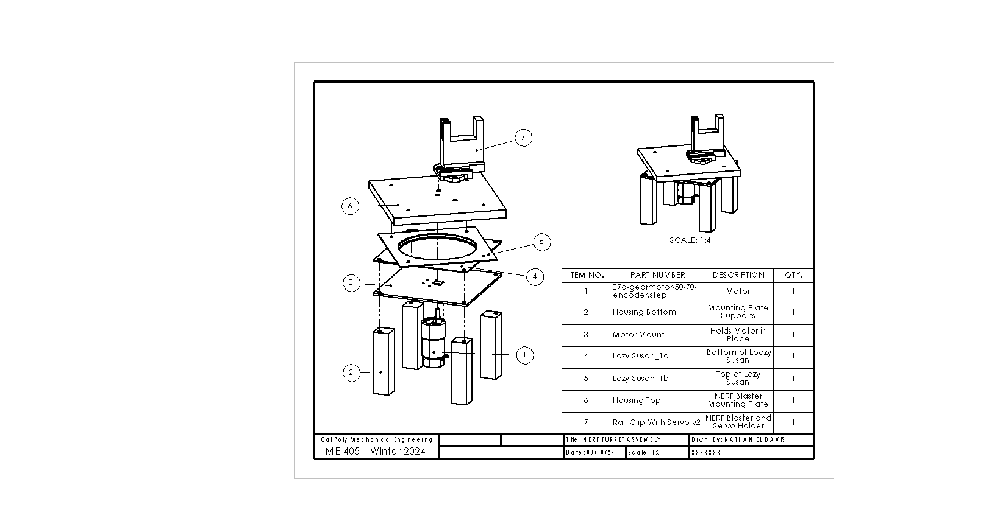

README.md
=========

# Introduction

The purpose of this device is to autonomously aim a NERF blaster at a target and fire it after the program is started. It is intended for use by children, with a similar use case as other foam-flinging toys, where the goal is to pelt friends and "foes" alike with harmless foam darts. However, the use of the design can reach far beyond foam darts. Given that the sensor detects heat signatures and operates based off of the greatest heat signature, the code can be used for other applications, such as autonomous fire control, where the device would aim water at a fire's greatest heat location to douse the fire (most often its base, which is where a fire should be targeted with water).

# Hardware

The hardware involved features a modified NERF blaster toy to fire the darts.[^1] This blaster is staged upon a flat plate that is on top of a lazy susan bearing. On the underside of the lazy susan bearing, there is a motor mounting plate. When the motor is mounted to this plate, it connects directly to the blaster base. Although the CAD model shows a single, uniform plate for mounting the NARF blaster, the mounting plate on the current turret uses two plates stacked - one made of acrylic and another made of wood. The acrylic plate is to ensure that there is no deformation, since the motor directly drives the plate on its shaft and acrylic is extremely brittle. The wood plate ensures that there is enough thickness that the motor shaft does not stick out. A list of materials outsourced materials is included below.

| **Item** | **Source** | **Function** | **Quantity** |
|---|---|---|---|
| NERF Modulus Stryfe Blaster | Amazon | Fires foam dart | 1 |
| Polulu 50:1 Metal Gearmotor  | Robotics Club | Drives blaster base plate | 1 |
| Lazy Susan  | Amazon | Allows rotation between  motor mount and blaster base plate | 1 |
| Mounting Plate - Wood | Manufactured - Laser Cut | Blaster mounting top plate | 1 |
| Mounting Plate - Acrylic | Manufactured - Laser Cut | Blaster mounting bottom plate | 1 |
| Motor Mounting Plate | 3D Printed | Motor mounting plate | 1 |
| Rail Clip with Servo  | 3D Printed | Connects servo, blaster, and  base plate | 1 |
| Towerpro MG995 | Robotics Club | Pulls blaster trigger | 1 |
| IRFZ44N | Amazon | MOSFET for controlling blaster flywheels | 1 |
| M3-0.5 Screws, 8 mm, 4-pack | Home Depot | Motor mounting screws | 2 |
| #10-32 Machine Screws and Nuts Combo, 3/4", 8-pack | Home Depot | Holds together base plate | 2 |
| #12 Wood Screws, 1-1/2", 3-pack | Home Depot | Attaches lower half of lazy susan and motor mounting plate to wooden supports | 2 |
| Wooden Legs | Home Depot | Turret supports | 4 |

[^1]: Given that NERF brand toys are not *guns* (which fire *bullets*), they will be referred to as *"blasters"* throughout this document (which fire *darts*).

https://www.pololu.com/product/4753/specs

https://servodatabase.com/servo/towerpro/mg995

https://www.amazon.com/NERF-Motorized-Extension-Official-Exclusive/dp/B06XWF6NYW

