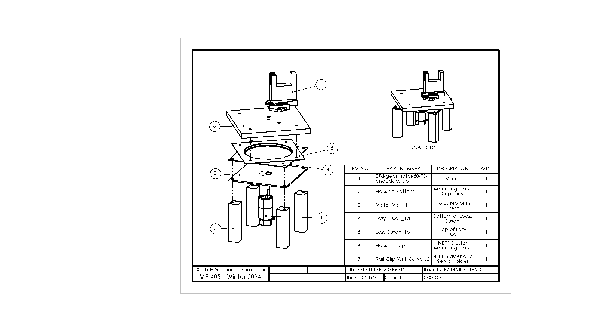

README.md
=========

# Introduction

The purpose of this device is to autonomously aim a NERF blaster at a target and fire it after the program is started. It is intended for use by children, with a similar use case as other foam-flinging toys, where the goal is to pelt friends and "foes" alike with harmless foam darts. However, the use of the design can reach far beyond foam darts. Given that the sensor detects heat signatures and operates based off of the greatest heat signature, the code can be used for other applications, such as autonomous fire control, where the device would aim water at a fire's greatest heat location to douse the fire (most often its base, which is where a fire should be targeted with water).

# Hardware

## Physical Contruction

The hardware involved features a modified NERF blaster toy to fire the darts.[^1] This blaster is staged upon a flat plate that is on top of a lazy susan bearing. On the underside of the lazy susan bearing, there is a motor mounting plate. When the motor is mounted to this plate, it connects directly to the blaster base. Although the CAD model shows a single, uniform plate for mounting the NARF blaster, the mounting plate on the current turret uses two plates stacked - one made of acrylic and another made of wood. The acrylic plate is to ensure that there is no deformation, since the motor directly drives the plate on its shaft and acrylic is extremely brittle. The wood plate ensures that there is enough thickness that the motor shaft does not stick out. A list of materials sourced from outside of the mechatronics lab is included in the [Materials](#materials) section.

[^1]: Given that NERF brand toys are not *guns* (which fire *bullets*), they will be referred to as *"blasters"* throughout this document (which fire *darts*).

## Circuitry

The circuitry for this device is relatively simple. There are 4 main peripheral electronics to the Nucleo. They are the main motor with encoder, the servo motor, the IR camera, and the NERF flywheels. Although all three are controlled by the Nucleo, the main motor and servo motor are powered by the 12V bench power supply and the flywheels are powered by the 6V battery pack inside of the NERF blaster. The pin connections and any relevant circuit diagrams are included below.

### Main Motor

| **Motor and Encoder Pin** | **Nucleo Pin** |
|---|---|
| Motor Power A | PB4 |
| Motor Power B | PB5 |
| Encoder V_cc | Power Supply 12V |
| Encoder Ground | GND |
| Encoder A Output | PC6 |
| Encoder B Output | PC7 |

This motor has 64 ticks per revolution internally. Given that the output ratio is 50:1, the motor effectively has 3200 ticks per revolution, which is the autoreload value used in the coding.

### Servo Motor

| **Servo Motor Pin** | **Nucleo Pin** |
|---|---|
| Servo Control | PB6 |
| V_in | Power Supply 12V |
| Servo Ground | GND |

Since the servo motor cannot handle 12 volts of power, it must use a voltage regulator to keep the servo power at 5 volts.

### IR Camera

| **IR Camera Pin** | **Nucleo Pin** |
|---|---|
| V_in | 3V3 |
| Ground | GND |
| SDA | B9 |
| SCL | B8 |

### Flywheels

| **Flywheel Pin** | **Nucleo Pin** |
|---|---|
| MOSFET Gate | PC3 |
| Ground | GND |

Pin C3 is used to control the NERF flyhweels.

## Materials

| **Item** | **Source** | **Link to Purchase or Info** | **Function** | **Quantity** |
|---|---|---|---|---|
| NERF Modulus Stryfe Blaster | Amazon | [Purchase](https://www.amazon.com/NERF-Motorized-Extension-Official-Exclusive/dp/B06XWF6NYW) | Fires foam dart | 1 |
| Polulu 50:1 Metal Gearmotor  | Robotics Club | [Info](https://www.pololu.com/product/4753/specs) | Drives blaster base plate | 1 |
| Lazy Susan  | Amazon | [Purchase](https://www.amazon.com/Turntable-bearing-rotating-cabinet-profile/dp/B08N52SVXF/ref=sr_1_5?crid=QEYA1NV8CA09&dib=eyJ2IjoiMSJ9.CMWjk2w-krsiL7peqCRVGm3W2gQaMjQGNbthVwyHQjTypNlGZs2VOZTHS3H_GIFq6Xziwl5j5dOtYv1_zar56G5uAWkpMtW1MNDaYM-67PEwL6wPoq9B0EWuAzYmD0b71HVDyV94N078vdZwfOOz1iGUHZBz31XryJTImlymTNS0DIW9eimfh2QxxdsWvfzapHUppExcQjaQf11oqseodX1cS_x_K5a1A84BwVE8K-Xo-ouSw5b62tj3LhWTRxUQgLhotKcvI61DQ2U9M_M4VuD9idzFSWsJsD2yY3MAz6A.tn3RYjO4Nj1wbqpFDI-VxyI9_y5sIj3FluF1KYcRKC4&dib_tag=se&keywords=lazy%2Bsusan%2Bbearing&qid=1710824558&sprefix=lazy%2Bsusan%2Bbearin%2Caps%2C155&sr=8-5&th=1) | Allows rotation between  motor mount and blaster base plate | 1 |
| Mounting Plate - Wood | Manufactured - Laser Cut | N/A | Blaster mounting top plate | 1 |
| Mounting Plate - Acrylic | Manufactured - Laser Cut | N/A | Blaster mounting bottom plate | 1 |
| Motor Mounting Plate | 3D Printed | N/A | Motor mounting plate | 1 |
| Rail Clip with Servo  | 3D Printed | N/A | Connects servo, blaster, and  base plate | 1 |
| Towerpro MG995 | Robotics Club | [Info](https://servodatabase.com/servo/towerpro/mg995) | Pulls blaster trigger | 1 |
| IRFZ44N | Amazon | [Purchase](https://www.amazon.com/dp/B07MW1N4Q5?psc=1&ref=ppx_yo2ov_dt_b_product_details) | MOSFET for controlling blaster flywheels | 1 |
| M3-0.5 Screws, 8 mm, 4-pack | Home Depot | N/A | Motor mounting screws | 2 |
| #10-32 Machine Screws and Nuts Combo, 3/4", 8-pack | Home Depot | N/A | Holds together base plate | 2 |
| #12 Wood Screws, 1-1/2", 3-pack | Home Depot | N/A | Attaches lower half of lazy susan and motor mounting plate to wooden supports | 2 |
| Wooden Legs, 4" | Home Depot | N/A | Turret supports | 4 |

# Software

The software used will be covered briefly here but will be discussed more extensively within the Doxygen documentation.

Due to the sequential nature of the dueling procedure, the device can be coded using a single task with multiple states instead of cotasking. The currently working version of main is *main_v2.py*, which uses this single task implementation. However, there is also the cotask version of the file, *main.py*. This version of main (main.py) is not fully debugged and still has issues, so main_v2.py is the used file for demonstration and will be the software discussed within the documentation.

The dueling is completed in 6 repeating steps, besides intialization. The peripheral(s) used during the step are shown in italics:

1. Wait for button press.
2. Wait 5 seconds.
3. Check current position of opponent. *-IR camera*
4. Turn to aim at opponent. *-Motor*
5. Fire. *-Servo, Flywheels*
6. Turn back around and reset to Step 1. *-Motor*

The full Doxygen documentation can be found [here](https://ndavis26.github.io/ME-405-Term-Proj/).

