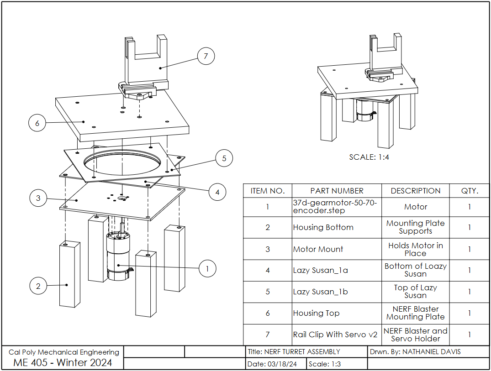

README.md
=========
Author: Nathaniel Davis

# Introduction

The purpose of this device is to autonomously aim a NERF blaster at a target and fire it after the program is started. It is intended for use by children, with a similar use case as other foam-flinging toys, where the goal is to pelt friends and "foes" alike with harmless foam darts. However, the use of the design can reach far beyond foam darts. Given that the sensor detects heat signatures and operates based off of the greatest heat signature, the code can be used for other applications, such as autonomous fire control, where the device would aim water at a fire's greatest heat location to douse the fire (most often its base, which is where a fire should be targeted with water).

  

# Hardware

## Physical Contruction

The hardware involved features a modified NERF blaster toy to fire the darts.[^1] This blaster is staged upon a flat plate that is on top of a lazy susan bearing. On the underside of the lazy susan bearing, there is a motor mounting plate. When the motor is mounted to this plate, it connects directly to the blaster base. Although the CAD model shows a single, uniform plate for mounting the NARF blaster, the mounting plate on the current turret uses two plates stacked - one made of acrylic and another made of wood. The acrylic plate is to ensure that there is no deformation, since the motor directly drives the plate on its shaft and acrylic is extremely brittle. The wood plate ensures that there is enough thickness that the motor shaft does not stick out. A list of materials sourced from outside of the mechatronics lab is included in the [Materials](#materials) section.

[^1]: Given that NERF brand toys are not *guns* (which fire *bullets*), they will be referred to as *"blasters"* throughout this document (which fire *darts*).

## Circuitry

The circuitry for this device is relatively simple. There are 4 main peripheral electronics to the Nucleo. They are the main motor with encoder, the servo motor, the IR camera, and the NERF flywheels. Although all three are controlled by the Nucleo, the main motor and servo motor are powered by the 12V bench power supply and the flywheels are powered by the 6V battery pack inside of the NERF blaster. The pin connections and any relevant circuit diagrams are included below.

### Main Motor

| **Motor and Encoder Pin** | **Nucleo Pin** |
|---|---|
| Motor Power A | PB4 |
| Motor Power B | PB5 |
| Encoder V_cc | Power Supply 12V |
| Encoder Ground | GND |
| Encoder A Output | PC6 |
| Encoder B Output | PC7 |

This motor has 64 ticks per revolution internally. Given that the output ratio is 50:1, the motor effectively has 3200 ticks per revolution, which is the autoreload value used in the coding.

### Servo Motor

| **Servo Motor Pin** | **Nucleo Pin** |
|---|---|
| Servo Control | PB6 |
| V_in | Power Supply 12V |
| Servo Ground | GND |

Since the servo motor cannot handle 12 volts of power, it must use a voltage regulator to keep the servo power at 5 volts.

### IR Camera

| **IR Camera Pin** | **Nucleo Pin** |
|---|---|
| V_in | 3V3 |
| Ground | GND |
| SDA | B9 |
| SCL | B8 |

### Flywheels

| **Flywheel Pin** | **Nucleo Pin** |
|---|---|
| MOSFET Gate | PC3 |
| Ground | GND |

Pin C3 is used to control the NERF flyhweels.

## Materials

| **Item** | **Source** | **Link to Purchase or Info** | **Function** | **Quantity** |
|---|---|---|---|---|
| NERF Modulus Stryfe Blaster | Amazon | [Purchase](https://www.amazon.com/NERF-Motorized-Extension-Official-Exclusive/dp/B06XWF6NYW) | Fires foam dart | 1 |
| Polulu 50:1 Metal Gearmotor  | Robotics Club | [Info](https://www.pololu.com/product/4753/specs) | Drives blaster base plate | 1 |
| Lazy Susan  | Amazon | [Purchase](https://www.amazon.com/Turntable-bearing-rotating-cabinet-profile/dp/B08N52SVXF/ref=sr_1_5?crid=QEYA1NV8CA09&dib=eyJ2IjoiMSJ9.CMWjk2w-krsiL7peqCRVGm3W2gQaMjQGNbthVwyHQjTypNlGZs2VOZTHS3H_GIFq6Xziwl5j5dOtYv1_zar56G5uAWkpMtW1MNDaYM-67PEwL6wPoq9B0EWuAzYmD0b71HVDyV94N078vdZwfOOz1iGUHZBz31XryJTImlymTNS0DIW9eimfh2QxxdsWvfzapHUppExcQjaQf11oqseodX1cS_x_K5a1A84BwVE8K-Xo-ouSw5b62tj3LhWTRxUQgLhotKcvI61DQ2U9M_M4VuD9idzFSWsJsD2yY3MAz6A.tn3RYjO4Nj1wbqpFDI-VxyI9_y5sIj3FluF1KYcRKC4&dib_tag=se&keywords=lazy%2Bsusan%2Bbearing&qid=1710824558&sprefix=lazy%2Bsusan%2Bbearin%2Caps%2C155&sr=8-5&th=1) | Allows rotation between  motor mount and blaster base plate | 1 |
| Mounting Plate - Wood | Manufactured - Laser Cut | N/A | Blaster mounting top plate | 1 |
| Mounting Plate - Acrylic | Manufactured - Laser Cut | N/A | Blaster mounting bottom plate | 1 |
| Motor Mounting Plate | 3D Printed | N/A | Motor mounting plate | 1 |
| Rail Clip with Servo  | 3D Printed | N/A | Connects servo, blaster, and  base plate | 1 |
| Towerpro MG995 | Robotics Club | [Info](https://servodatabase.com/servo/towerpro/mg995) | Pulls blaster trigger | 1 |
| IRFZ44N | Amazon | [Purchase](https://www.amazon.com/dp/B07MW1N4Q5?psc=1&ref=ppx_yo2ov_dt_b_product_details) | MOSFET for controlling blaster flywheels | 1 |
| M3-0.5 Screws, 8 mm, 4-pack | Home Depot | N/A | Motor mounting screws | 2 |
| #10-32 Machine Screws and Nuts Combo, 3/4", 8-pack | Home Depot | N/A | Holds together base plate | 2 |
| #12 Wood Screws, 1-1/2", 3-pack | Home Depot | N/A | Attaches lower half of lazy susan and motor mounting plate to wooden supports | 2 |
| Wooden Legs, 4" | Home Depot | N/A | Turret supports | 4 |

  

# Software

The dueling is completed in 7 repeating steps, besides intialization. The peripheral(s) used during the step are shown in italics:

1. Wait for button press.
2. Turn to face opponent. *-Motor*
3. Wait 5 seconds.
4. Check current position of opponent. *-IR camera*
5. Adjust aim. *-Motor*
6. Fire. *-Servo, Flywheels*
7. Turn back around and reset to Step 1. *-Motor*

## Files

The files used are:
* [main_v3.py](https://github.com/ndavis26/ME-405-Term-Proj/blob/main/src/main_v3.py) - Holds the tasks and states of the device
* [motor_driver_updated.py](https://github.com/ndavis26/ME-405-Term-Proj/blob/main/src/motor_driver_updated.py) - Reference for motor class object. This class sets the PWM of the motor
* [encoder_reader_updated.py](https://github.com/ndavis26/ME-405-Term-Proj/blob/main/src/encoder_reader_updated.py) - Reference for encoder class object. This class reads the motor encoder
* [motorwithencoder_updated.py](https://github.com/ndavis26/ME-405-Term-Proj/blob/main/src/motorwithencoder_updated.py) -  Reference for the motor controller class object. This class controls the motor through PI control.
* [servo.py](https://github.com/ndavis26/ME-405-Term-Proj/blob/main/src/servo.py) -  Reference for the servo class object. This class controls the servo through pulse width signals.
* [mlx_cam.py](https://github.com/ndavis26/ME-405-Term-Proj/blob/main/src/mlx_cam.py) - Reference for the IR camera class object. This class takes pictures using the IR camera by TWI communication.

The full Doxygen documentation of all the files can be found [here](https://ndavis26.github.io/ME-405-Term-Proj/).

## Tasks / States

Due to the sequential nature of the dueling procedure, only two tasks are needed. 

### Task 1: Mastermind
The first task handles the looping dueling procedure. It involves 7 states. There is only 1 intertask variable, *motor_setpoint*, which stores the motor setpoint.

**S0: INIT**  
This state intializes the system. It sets the servo control pins, the flywheel pins, the start button on the Nucleo, and initializes the IR camera.

**S1: BUTTON**  
Repeatedly checks if the blue button on the Nucleo has been pressed. If it has been pressed, the state transitions to state 2. If not pressed, the state does nothing and yields.

**S2: WAIT**  
Turns around the NERF blaster 180 degrees and waits for 5 seconds. The state accomplishes this by waiting for 10 ms intervals at a time and yielding in between each interval.

**S3: CAM**  
This state checks if an image has been captured from the IR camera. If no image has been captured, the state does nothing and yields. If there is an image, the state finds the line within the data with the greatest heat value sum and produces an angle to turn to.

**S4: MOTOR**  
Using the angle produced in state 3, the motor setpoint is adjusted to achieve the desired angle.

**S5: FIRE**  
This state starts the uninterruptible firing sequence:
1. Flywheels on
2. Servo pulls trigger
3. Flywheels off
4. Servo returns to its original position

**S6: RESET**  
Turns the blaster back around and resets to state 1.

### Task 2: Motor Control
The second task simply handles the motor control. It constantly tries to reach the motor setpoint defined by the *motor_setpoint* intertask variable. The motor controller uses PI control to accurately (albeit slowly) obtain the proper angle. There are only 2 states.

**S0: INIT**  
This state intializes the motor control. Here, the motor and encoder pins are defined and the motor, encoder, and motor controller class objects are created.

**S1: UPDATE_MOTOR**  
Repeatedly udpates the PWM to the motor through PI control. The setpoint used is pulled from motor_setpoint.

  

# Results

The system was tested through repeated dueling. Unfortunately there are many flaws to this system.

The device can properly turn to face the opponent, check the camera, adjust accordingly, and turn on the flywheels, but is unfortunately unable to fire darts.

The first flaw is the trigger system. The first servo we used drew too much current, which I did not discover until later in the project. While testing the servo and firing procedure, I had been using my desktop computer as the USB power source for the Nucleo, which had sufficient current supply. However, when I began to use my laptop, the current draw (which exceeded the ~0.5 amp fuse in the USB port), it shut my laptop off. We began to search for other solutions, including using a voltage regulator, which only works some of the time. If the torque of the motor ever accidentally exceeds a certain amount, the voltage regulator will drop to 1 volt supplied to the servo. If given more time, a more robust servo trigger system would be devloped. It would require a combination of circuit redesign to get the current needed to the servo as well as manufacturing redesign to make sure the servo motor does not have to exert as much effort (and can pull the trigger more reliably).

The second flaw is in the PI motor control. The first and last moves of the duel are large, 180 degree turns that do not need to be accurate but need to be quick. In this case, a larger Kp and a smaller Ki is desired, as too large of a Ki causes the motor to overshoot by a large amount and then swing across the desired setpoint wildly. During the fine targeting after receiving the camera info, however, there is only a small difference between the motor's current position and the desired setpoint. In this case, a larger Ki is desired to make that small difference matter and provide more rapid fine adjustment. If given more time, more intertask variables would be implemented to allow control of the Ki and Kp values from Task 1: Mastermind to adjust the Kp and Ki during each move.

The third flaw is in the motor shaft power transfer. There is too much tolerance between the motor shaft and the blaster base plate. Although the motor can supply the necessary torque to spin the plate, an independent geared system would have better sufficed to allow greater precision in the angle. This is compounded by the fact that the motor chosen only has 3200 ticks per revolution (as compared to the standard ME 405 kit's motor with 65535 ticks per revolution).

The final flaw is in the IR adjustment. It is not well tuned. This is also due to the motor control inacurracy decribed in the third flaw.